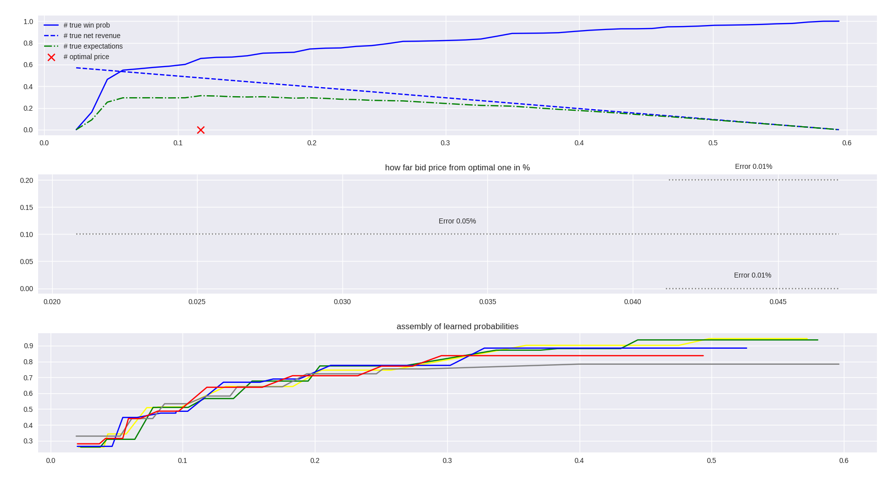

<a name="readme-top"></a>

# Online Bid Optimizer for DSPs and AdExchange Paltforms
Online/adaptive learning bid optimizer

It's a key to be able to adopt your bid optimizer very fast since upstream auction winning price 
distribution are changing very fast and classic offline trained models can't catch that change in time.


if we knew upstream winning curve distribution we could estimate best bid price by calculating maximum expected 
bid price under the winning curve distribute. 
So task is reduced to estimate upstream winning curve as accurate as possible in the short period of time and later adopt it in runtime.

## Estimation of winning price distribution on upstream auction
1. Discretize feasible price range with exponential distribution for the different values of the λ parameters.
2. For each discrete range esitmate Beta distribution.
3. Unbiased estimate for the bid price winning probability on upstream for each discretized range is going to be the expectation of the estimated Beta distribution : α / (α + β)

During inferencing we will calculate ArgMax(Bid Price * Estimated Probability To Win) for each discretized feasible bid price range and average them.



## Build and run
### Server
```
make tidy
``` 
```
make audit
```
```
make build
```
```
/tmp/bin/a.out
```

### Client
```
pipenv shell
```
```
python main.py
```

<p align="right">(<a href="#readme-top">back to top</a>)</p>

### TODO
- [ ] Use exploitation feedback for free update.
- [ ] Use exploitation feedback for online evaluation.
- [ ] For evaluation and quality use Chernoff bound.
- [ ] Add weighted average.
- [ ] Add demo to show gain.

<p align="right">(<a href="#readme-top">back to top</a>)</p>
